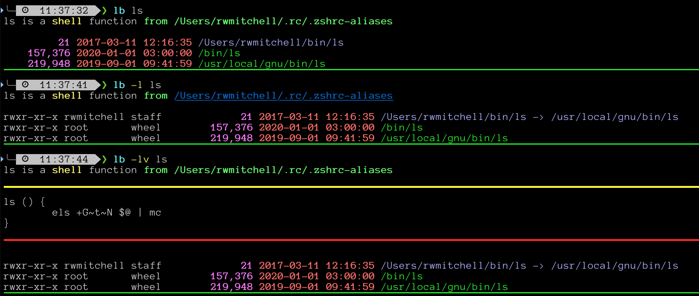
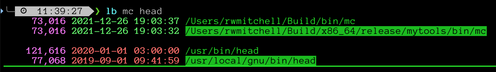

# lb: zsh addon

## About
Robust 'which' replacement combining output from other
standard commands to show more info about the program, function
or alias.

Source for scripts and functions can be optionally displayed.

This is my first contribution of personal use code.

## Usage
### Output from 'lb -h'
```
lb_help -Cefilrvh CMD [CMD]

Find location of executable, function, or alias

  -C: colorize source
  -f: show 'file' output for executables
  -i: show 'ident' information
  -l: long ls output
  -r: reload function
  -e: edit function
  -v: show script and function source
```
## Examples:


Primary is a zsh function, but other executables exist



Program exist in multiple paths, primary is highlighted

## Requirements

The '-C' option uses 'colorize_cat' from the 'colorize' plugin found in OMZ.

Additional information about the type of file is displayed using the unix
'file' command and assumed to be present.

## Installation
Copy or ln 'lb' to your location for loading autoload zsh tools.
